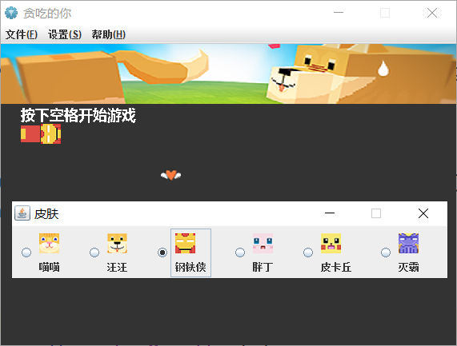
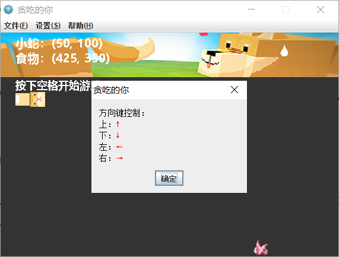
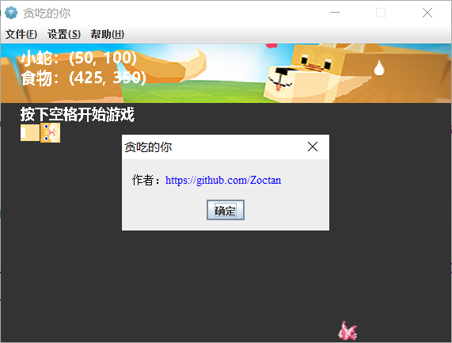

# Oh!Snack

English | [简体中文](./README-zh.md)

🐍Snake game in Java. (BGM + Skin + Record Save/Load)

## Function

* Done：
    - [x] Basic operation
    - [x] Save/Load record
    - [x] Profile setting
    - [x] Skin setting
    - [x] Background music

* Future：
    - [ ] Doc

## Preview

<table>
	<tr>
		<td></td>
		<td></td>
	</tr>
	<tr>
		<td></td>
		<td></td>
	</tr>
	<tr>
		<td></td>
		<td></td>
	</tr>
	<tr>
		<td></td>
		<td></td>
	</tr>
</table>
