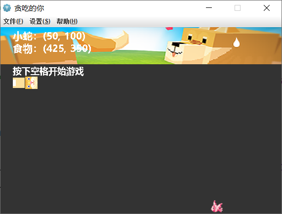

# Oh!Snack

## 简介

Java 实现的贪吃蛇，还有很多设想功能未实现……

todoList:
    - [ ] 载入存档
    - [ ] 进度存档
    - [ ] 动态配置
    - [ ] 皮肤
    - [ ] 背景音乐
    - [ ] 文档完善

## 预览

<table>
	<tr>
		<td></td>
		<td></td>
	</tr>
	<tr>
		<td></td>
		<td></td>
	</tr>
</table>
